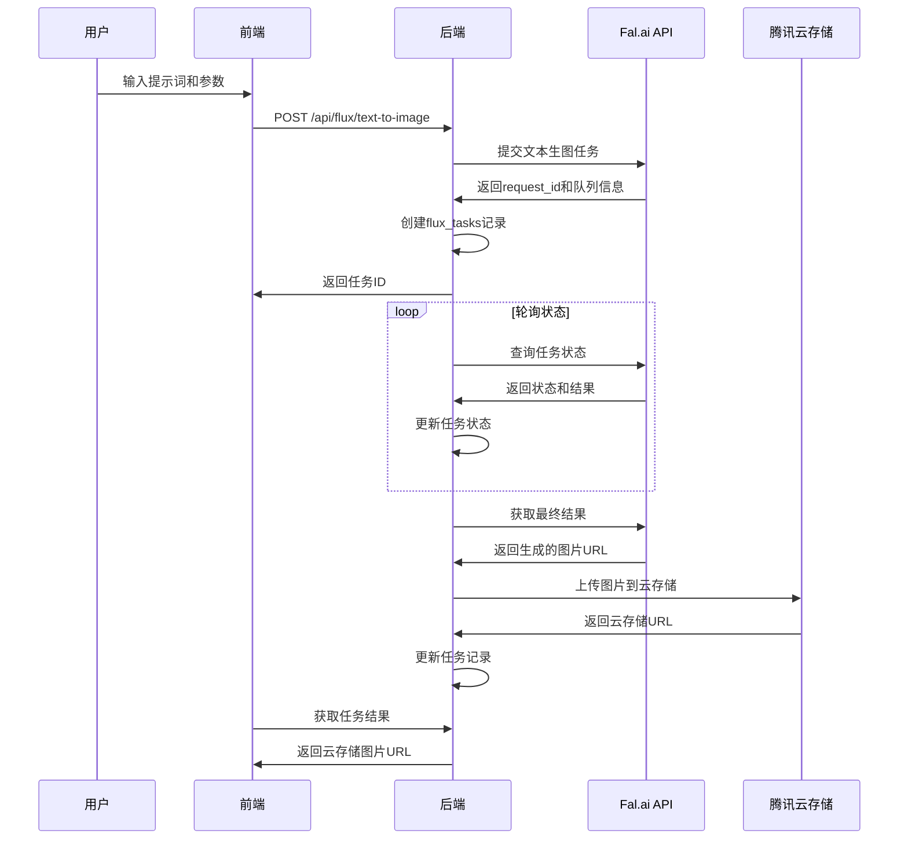
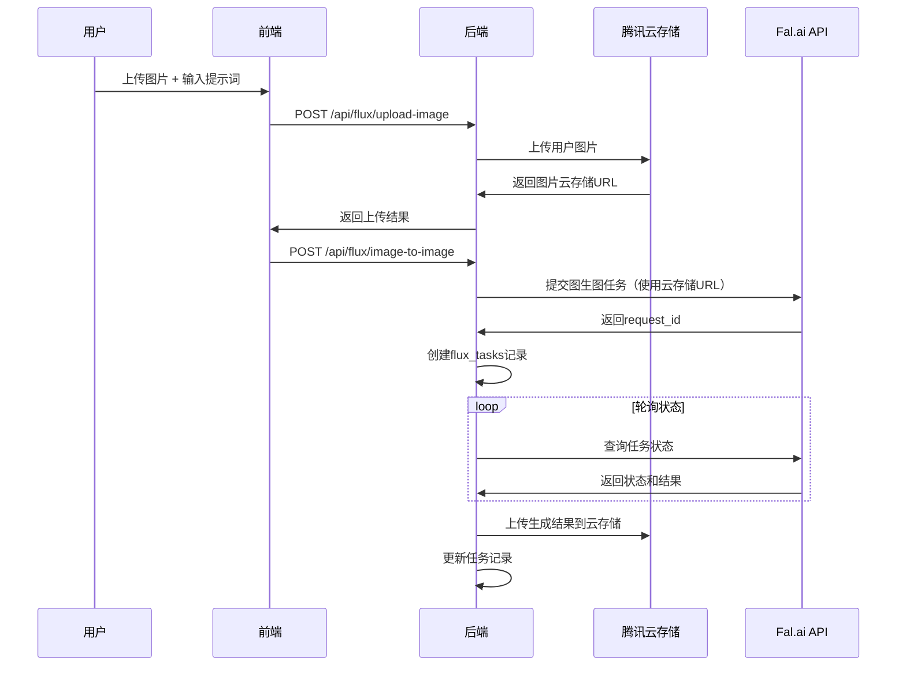

# Flux 图像生成功能集成方案

> 📅 创建时间: 2025-08-19
> 🧑‍💻 开发者: Claude (AI Assistant)  
> 📋 项目: Flux AI 图像生成功能集成到 Open WebUI

## 🎯 功能概述

将 Flux 系列 AI 图像生成模型集成到现有的图像生成页面，支持文本生图和图生图功能，与 Midjourney 和即梦绘画共享统一的历史记录系统。

## 🧩 支持的 Flux 模型

| 模型ID                                      | 模型名称             | 功能类型 | 特点               |
| ------------------------------------------- | -------------------- | -------- | ------------------ |
| `fal-ai/flux-1/dev`                         | FLUX.1 Dev           | 文本生图 | 开发版本，适合测试 |
| `fal-ai/flux-1/dev/image-to-image`          | FLUX.1 Dev 图生图    | 图生图   | 基于输入图片生成   |
| `fal-ai/flux-1/dev/redux`                   | FLUX.1 Dev Redux     | 图片增强 | Redux风格处理      |
| `fal-ai/flux-1/schnell`                     | FLUX.1 Schnell       | 文本生图 | 快速生成版本       |
| `fal-ai/flux-1/schnell/redux`               | FLUX.1 Schnell Redux | 图片增强 | 快速Redux版本      |
| `fal-ai/flux-pro/kontext`                   | FLUX.1 Pro           | 文本生图 | 专业版本           |
| `fal-ai/flux-pro/kontext/max`               | FLUX.1 Pro Max       | 文本生图 | 最高质量版本       |
| `fal-ai/flux-pro/kontext/max/multi`         | FLUX.1 Pro Max Multi | 多图生成 | 实验性多图编辑     |
| `fal-ai/flux-pro/kontext/max/text-to-image` | FLUX.1 Pro Max T2I   | 文本生图 | 专门的文本转图像   |
| `fal-ai/flux-pro/kontext/multi`             | FLUX.1 Pro Multi     | 多图生成 | 实验性多图编辑     |
| `fal-ai/flux-pro/kontext/text-to-image`     | FLUX.1 Pro T2I       | 文本生图 | 专门的文本转图像   |

## 🏗️ 技术架构设计

### 数据库设计

#### 1. flux_config 表（配置管理）

```sql
CREATE TABLE flux_config (
    id VARCHAR(255) PRIMARY KEY,
    api_key TEXT NOT NULL,                    -- Fal.ai API密钥
    base_url VARCHAR(500) NOT NULL,           -- API基础URL
    enabled BOOLEAN DEFAULT TRUE,             -- 启用状态
    timeout INTEGER DEFAULT 300,             -- 请求超时时间（秒）
    max_concurrent_tasks INTEGER DEFAULT 5,   -- 最大并发任务数
    default_model VARCHAR(100) DEFAULT 'fal-ai/flux-1/dev',
    created_at DATETIME DEFAULT CURRENT_TIMESTAMP,
    updated_at DATETIME DEFAULT CURRENT_TIMESTAMP
);
```

#### 2. flux_tasks 表（任务记录）

```sql
CREATE TABLE flux_tasks (
    id VARCHAR(255) PRIMARY KEY,             -- 任务ID
    user_id VARCHAR(255) NOT NULL,           -- 用户ID
    request_id VARCHAR(255) NOT NULL,        -- Fal.ai返回的请求ID

    -- 任务基本信息
    model VARCHAR(100) NOT NULL,             -- 使用的模型
    task_type VARCHAR(20) NOT NULL,          -- 'text_to_image', 'image_to_image'
    status VARCHAR(20) DEFAULT 'PENDING',    -- 'PENDING', 'IN_QUEUE', 'IN_PROGRESS', 'SUCCESS', 'FAILED'

    -- 输入参数
    prompt TEXT,                             -- 文本提示词
    input_image_url TEXT,                    -- 输入图片URL（图生图）
    uploaded_image_url TEXT,                 -- 用户上传后的云存储URL

    -- 生成参数
    num_images INTEGER DEFAULT 1,           -- 生成图片数量
    aspect_ratio VARCHAR(20) DEFAULT '1:1',  -- 宽高比
    guidance_scale FLOAT DEFAULT 3.5,       -- 引导系数
    num_inference_steps INTEGER DEFAULT 28,  -- 推理步数
    seed INTEGER,                            -- 随机种子
    safety_tolerance VARCHAR(10) DEFAULT '2', -- 安全容忍度
    strength FLOAT DEFAULT 0.95,            -- 图生图强度

    -- 结果信息
    image_url TEXT,                          -- 生成的图片URL
    cloud_image_url TEXT,                    -- 云存储图片URL
    generation_time FLOAT,                   -- 生成耗时
    queue_position INTEGER,                  -- 队列位置

    -- 错误信息
    error_message TEXT,                      -- 错误信息
    retry_count INTEGER DEFAULT 0,          -- 重试次数

    -- 时间信息
    created_at DATETIME DEFAULT CURRENT_TIMESTAMP,
    updated_at DATETIME DEFAULT CURRENT_TIMESTAMP,
    completed_at DATETIME,

    -- 索引
    INDEX idx_flux_tasks_user_id (user_id),
    INDEX idx_flux_tasks_status (status),
    INDEX idx_flux_tasks_request_id (request_id),
    INDEX idx_flux_tasks_created_at (created_at)
);
```

#### 3. flux_credits 表（积分系统，可选）

```sql
CREATE TABLE flux_credits (
    id VARCHAR(255) PRIMARY KEY,
    user_id VARCHAR(255) NOT NULL,
    credits_balance INTEGER DEFAULT 0,       -- 剩余积分
    total_used INTEGER DEFAULT 0,           -- 已使用积分
    created_at DATETIME DEFAULT CURRENT_TIMESTAMP,
    updated_at DATETIME DEFAULT CURRENT_TIMESTAMP,

    INDEX idx_flux_credits_user_id (user_id)
);
```

### API 调用流程设计

#### 文本生图流程



#### 图生图流程



## 🔧 后端开发架构

### 1. 数据模型 (models/flux.py)

```python
class FluxConfig(Base):
    __tablename__ = "flux_config"
    # ... 字段定义

class FluxTask(Base):
    __tablename__ = "flux_tasks"
    # ... 字段定义

    def to_dict(self):
        """转换为字典格式，用于API返回"""
        return {
            "id": self.id,
            "status": self.status,
            "model": self.model,
            "prompt": self.prompt,
            "image_url": self.cloud_image_url or self.image_url,
            "created_at": self.created_at.isoformat(),
            # ... 其他字段
        }
```

### 2. API 路由 (routers/flux.py)

```python
@router.post("/text-to-image")
async def create_text_to_image_task(
    request: FluxTextToImageRequest,
    user = Depends(get_verified_user)
):
    """文本生成图片"""
    pass

@router.post("/image-to-image")
async def create_image_to_image_task(
    request: FluxImageToImageRequest,
    user = Depends(get_verified_user)
):
    """图片生成图片"""
    pass

@router.post("/upload-image")
async def upload_image_for_flux(
    file: UploadFile,
    user = Depends(get_verified_user)
):
    """上传图片到云存储，用于图生图"""
    pass

@router.get("/task/{task_id}")
async def get_task_status(
    task_id: str,
    user = Depends(get_verified_user)
):
    """获取任务状态"""
    pass

@router.get("/history")
async def get_user_flux_history(
    page: int = 1,
    limit: int = 20,
    user = Depends(get_verified_user)
):
    """获取用户Flux历史记录"""
    pass
```

### 3. Flux API 客户端 (utils/flux_api.py)

```python
class FluxAPIClient:
    def __init__(self, config: FluxConfig):
        self.base_url = config.base_url
        self.api_key = config.api_key

    async def submit_text_to_image(self, model: str, params: dict):
        """提交文本生图任务"""
        pass

    async def submit_image_to_image(self, model: str, params: dict):
        """提交图生图任务"""
        pass

    async def get_task_status(self, model: str, request_id: str):
        """查询任务状态"""
        pass

    async def get_task_result(self, model: str, request_id: str):
        """获取任务结果"""
        pass
```

### 4. 后台任务轮询 (services/flux_service.py)

```python
async def poll_flux_task_status(task_id: str):
    """后台轮询Flux任务状态"""
    max_attempts = 300  # 最大轮询次数
    attempt = 0

    while attempt < max_attempts:
        task = FluxTask.get_task_by_id(task_id)
        if not task or task.status in ['SUCCESS', 'FAILED']:
            break

        # 查询远程状态
        client = get_flux_client()
        result = await client.get_task_status(task.model, task.request_id)

        # 更新本地状态
        task.update_from_flux_response(result)

        if task.status == 'SUCCESS':
            # 上传到云存储
            await upload_result_to_cloud_storage(task)
            break

        await asyncio.sleep(5)  # 5秒间隔
        attempt += 1
```

## 🎨 前端集成设计

### 1. 集成到现有图像生成页面

在 `src/routes/(app)/images/+page.svelte` 中添加：

#### Flux 模型选择器

```svelte
<div class="flux-model-selector">
	<select bind:value={selectedFluxModel}>
		<option value="fal-ai/flux-1/dev">FLUX.1 Dev（开发版）</option>
		<option value="fal-ai/flux-1/schnell">FLUX.1 Schnell（快速版）</option>
		<option value="fal-ai/flux-pro/kontext/max">FLUX.1 Pro Max（最高质量）</option>
		<!-- ... 其他模型 -->
	</select>
</div>
```

#### 功能模式选择

```svelte
<div class="generation-mode">
	<button class:active={mode === 'text-to-image'} on:click={() => (mode = 'text-to-image')}>
		文本生图
	</button>
	<button class:active={mode === 'image-to-image'} on:click={() => (mode = 'image-to-image')}>
		图生图
	</button>
</div>
```

#### 图片上传组件（图生图模式）

```svelte
{#if mode === 'image-to-image'}
	<div class="image-upload">
		<input type="file" accept="image/*" on:change={handleImageUpload} />
		{#if uploadedImageUrl}
			
		{/if}
	</div>
{/if}
```

### 2. 统一历史记录显示

修改现有的历史记录组件，支持显示 Flux 生成的图片：

```svelte
<!-- ImageHistory.svelte -->
<div class="image-history">
	{#each imageHistory as item}
		<div class="history-item">
			
			<div class="item-info">
				<span class="model-tag" class:flux={item.source === 'flux'}>
					{item.source === 'flux' ? item.model : item.source}
				</span>
				<p class="prompt">{item.prompt}</p>
				<time>{item.created_at}</time>
			</div>
		</div>
	{/each}
</div>
```

### 3. API 调用封装 (apis/flux/index.ts)

```typescript
export interface FluxTextToImageRequest {
	model: string;
	prompt: string;
	num_images?: number;
	aspect_ratio?: string;
	guidance_scale?: number;
	num_inference_steps?: number;
	seed?: number;
}

export interface FluxImageToImageRequest extends FluxTextToImageRequest {
	image_url: string;
	strength?: number;
}

export const fluxAPI = {
	async textToImage(request: FluxTextToImageRequest): Promise<FluxTask> {
		// ...
	},

	async imageToImage(request: FluxImageToImageRequest): Promise<FluxTask> {
		// ...
	},

	async uploadImage(file: File): Promise<{ url: string }> {
		// ...
	},

	async getTaskStatus(taskId: string): Promise<FluxTask> {
		// ...
	},

	async getHistory(page: number = 1): Promise<FluxTask[]> {
		// ...
	}
};
```

## 🔄 云存储集成流程

### 1. 用户上传图片处理

```python
# 图生图时用户上传的图片处理
async def handle_user_image_upload(file: UploadFile, user_id: str):
    # 1. 验证文件类型和大小
    if not file.content_type.startswith('image/'):
        raise HTTPException(400, "只支持图片文件")

    # 2. 上传到腾讯云存储
    file_manager = get_file_manager()
    success, message, file_record = await file_manager.save_generated_content(
        user_id=user_id,
        file_data=await file.read(),
        filename=f"flux_input_{uuid.uuid4()}.jpg",
        file_type="image",
        source_type="flux_input",
        metadata={"original_filename": file.filename}
    )

    if success and file_record:
        return file_record.cloud_url
    else:
        raise HTTPException(500, f"图片上传失败: {message}")
```

### 2. 生成结果自动上传

```python
# Flux生成完成后自动上传结果
async def upload_flux_result_to_cloud_storage(task: FluxTask):
    if not task.image_url:
        return

    file_manager = get_file_manager()
    success, message, file_record = await file_manager.save_generated_content(
        user_id=task.user_id,
        file_url=task.image_url,
        filename=f"flux_{task.model.replace('/', '_')}_{task.id}.jpg",
        file_type="image",
        source_type="flux",
        source_task_id=task.id,
        metadata={
            "model": task.model,
            "prompt": task.prompt,
            "task_type": task.task_type
        }
    )

    if success and file_record:
        # 更新任务记录中的云存储URL
        with get_db() as db:
            db_task = db.query(FluxTask).filter(FluxTask.id == task.id).first()
            if db_task:
                db_task.cloud_image_url = file_record.cloud_url
                db.commit()
```

## 📊 统一历史记录系统

### 数据库视图设计

创建统一的图像生成历史视图：

```sql
CREATE VIEW unified_image_history AS
SELECT
    'midjourney' as source,
    id,
    user_id,
    prompt,
    image_url,
    status,
    created_at
FROM mj_tasks
WHERE status = 'SUCCESS' AND image_url IS NOT NULL

UNION ALL

SELECT
    'jimeng' as source,
    id,
    user_id,
    prompt,
    image_url,
    status,
    created_at
FROM dreamwork_tasks
WHERE status = 'SUCCESS' AND image_url IS NOT NULL

UNION ALL

SELECT
    'flux' as source,
    id,
    user_id,
    prompt,
    COALESCE(cloud_image_url, image_url) as image_url,
    status,
    created_at
FROM flux_tasks
WHERE status = 'SUCCESS' AND (image_url IS NOT NULL OR cloud_image_url IS NOT NULL)

ORDER BY created_at DESC;
```

### 统一历史记录 API

```python
@router.get("/unified-history")
async def get_unified_image_history(
    page: int = 1,
    limit: int = 20,
    source: Optional[str] = None,  # 'midjourney', 'flux', 'jimeng'
    user = Depends(get_verified_user)
):
    """获取统一的图像生成历史记录"""
    with get_db() as db:
        query = text("""
            SELECT * FROM unified_image_history
            WHERE user_id = :user_id
            AND (:source IS NULL OR source = :source)
            ORDER BY created_at DESC
            LIMIT :limit OFFSET :offset
        """)

        result = db.execute(query, {
            "user_id": user.id,
            "source": source,
            "limit": limit,
            "offset": (page - 1) * limit
        })

        return [dict(row) for row in result]
```

## ⚠️ 重要注意事项

### 数据库迁移规范

**必须严格按照项目的Alembic迁移系统执行数据库变更，否则Docker工作流部署时会报错！**

#### 正确的迁移流程：

```bash
# 1. 先创建数据模型文件
# 创建 backend/open_webui/models/flux.py

# 2. 生成标准的Alembic迁移文件
cd backend
alembic revision --autogenerate -m "add_flux_tables"

# 3. 检查生成的迁移文件并调整
# 检查 backend/open_webui/migrations/versions/xxx_add_flux_tables.py

# 4. 执行迁移
alembic upgrade head

# 5. 验证迁移结果
python -c "from open_webui.internal.db import get_db; print('Migration successful')"
```

#### 迁移文件示例结构：

```python
"""add_flux_tables

Revision ID: f1a2b3c4d5e6
Revises: a1b2c3d4e5f8
Create Date: 2025-08-19 12:00:00.000000
"""

from typing import Sequence, Union
from alembic import op
import sqlalchemy as sa
import open_webui.internal.db

# revision identifiers, used by Alembic.
revision: str = "f1a2b3c4d5e6"
down_revision: Union[str, None] = "a1b2c3d4e5f8"  # 基于最新的云存储迁移
branch_labels: Union[str, Sequence[str], None] = None
depends_on: Union[str, Sequence[str], None] = None

def upgrade() -> None:
    # ### commands auto generated by Alembic - please adjust! ###
    # 创建flux_config表
    # 创建flux_tasks表
    # 创建flux_credits表
    # 创建必要的索引
    # ### end Alembic commands ###

def downgrade() -> None:
    # ### commands auto generated by Alembic - please adjust! ###
    # 删除表和索引的回滚操作
    # ### end Alembic commands ###
```

#### 关键注意事项：

1. **版本依赖**: 新迁移必须基于当前最新版本 `a1b2c3d4e5f8`
2. **自动生成**: 使用 `--autogenerate` 参数让Alembic自动检测模型变更
3. **手动调整**: 生成后检查迁移文件，必要时手动调整
4. **测试验证**: 迁移后必须验证表结构和索引是否正确创建
5. **Docker兼容**: 确保迁移文件与Docker环境兼容

## 🚀 开发里程碑

### Phase 1: 基础设施（1-2天）

- [ ] 创建数据模型文件（models/flux.py）
- [ ] **按Alembic规范创建数据库迁移文件**（flux_config, flux_tasks, flux_credits）
- [ ] 执行迁移并验证表结构
- [ ] 实现 Flux API 客户端（utils/flux_api.py）
- [ ] 基础配置管理功能

### Phase 2: 核心 API（2-3天）

- [ ] 实现文本生图 API
- [ ] 实现图生图 API（包含图片上传）
- [ ] 实现任务状态查询 API
- [ ] 实现后台任务轮询系统
- [ ] 集成云存储自动上传

### Phase 3: 前端集成（2天）

- [ ] 修改现有图像生成页面，添加 Flux 选项
- [ ] 实现模型选择器和参数配置
- [ ] 实现图片上传组件
- [ ] 前端 API 调用封装

### Phase 4: 历史记录统一（1天）

- [ ] 创建统一历史记录视图
- [ ] 修改历史记录 API
- [ ] 更新前端历史记录组件

### Phase 5: 测试和优化（1天）

- [ ] 功能测试
- [ ] 性能优化
- [ ] 错误处理完善
- [ ] 文档更新

## 🔐 安全和限制

### API 安全

- 所有 Flux API 调用需要用户认证
- API Key 安全存储，不暴露给前端
- 请求频率限制防止滥用

### 文件安全

- 用户上传图片大小限制（如 10MB）
- 支持的文件格式限制（jpg, png, webp）
- 恶意文件检测

### 积分系统（可选）

- 不同模型消耗不同积分
- 用户积分余额检查
- 积分消费记录

## 📈 监控和分析

### 关键指标

- Flux 任务成功率
- 平均生成时间
- 各模型使用频率
- 云存储使用量
- 用户满意度

### 错误监控

- API 调用失败率
- 任务超时率
- 云存储上传失败率
- 用户投诉和反馈

---

> 📝 **备注**: 此文档为 Flux 图像生成功能的完整集成方案，涵盖了从数据库设计到前端集成的所有技术细节。开发时请按照里程碑逐步实施，确保每个阶段的功能完整性和稳定性。
