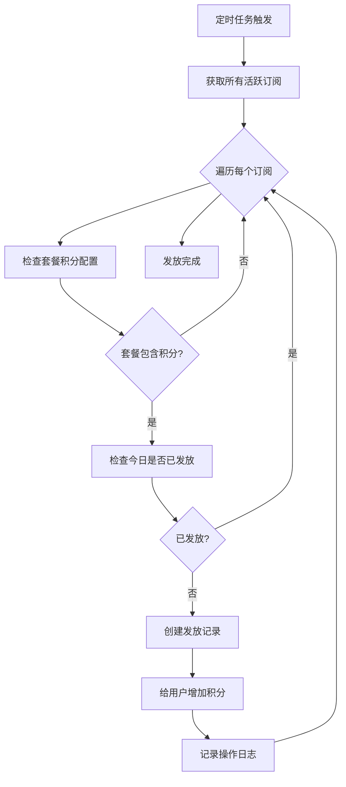

# 每日积分发放功能说明

## 功能概述

该功能实现了基于订阅套餐的每日积分自动发放系统。用户订阅套餐后，系统会每天自动为用户发放套餐中包含的积分数量，直到套餐到期。

## 核心特性

### 🎯 主要功能
- **自动每日发放**：系统每天自动为活跃订阅用户发放积分
- **防重复发放**：确保每个用户每天只能获得一次积分发放
- **套餐关联**：积分数量基于用户订阅的套餐配置
- **发放记录**：完整记录每次积分发放的历史
- **灵活管理**：支持手动触发和批量处理

### 🔧 技术特性
- **自动化调度**：基于定时任务的自动执行机制
- **数据安全**：事务处理确保数据一致性
- **高效查询**：优化的数据库索引和查询
- **错误处理**：完善的异常处理和日志记录

## 数据库结构

### 新增表结构

#### `subscription_daily_credit_grants` - 每日积分发放记录表
```sql
- id: 记录ID（主键）
- user_id: 用户ID（索引）
- subscription_id: 订阅ID（外键）
- plan_id: 套餐ID（外键）
- grant_date: 发放日期（当天0点的时间戳，索引）
- credits_granted: 发放的积分数量
- created_at: 创建时间
```

### 修改的表结构

#### `subscription_plans` - 套餐表
```sql
- credits: 套餐每日包含的积分数量（已存在字段）
```

## API接口

### 🔐 管理员接口

#### 1. 手动触发全局每日积分发放
```http
POST /api/subscription/daily-credits/process
Authorization: Bearer <admin_token>
```

**响应示例：**
```json
{
  "success": true,
  "total_subscriptions": 150,
  "successful_grants": 148,
  "failed_grants": 2,
  "message": "处理完成: 成功发放 148 个用户的积分"
}
```

#### 2. 为指定用户手动发放积分
```http
POST /api/subscription/daily-credits/grant/{user_id}
Authorization: Bearer <admin_token>
```

**响应示例：**
```json
{
  "success": true,
  "data": {
    "id": "grant_123",
    "user_id": "user_001",
    "credits_granted": 1000
  },
  "message": "成功为用户 user_001 发放 1000 积分"
}
```

### 👤 用户接口

#### 3. 获取积分发放历史
```http
GET /api/subscription/daily-credits/history/{user_id}?page=1&limit=10
Authorization: Bearer <user_token>
```

**响应示例：**
```json
{
  "success": true,
  "total": 30,
  "page": 1,
  "limit": 10,
  "grants": [
    {
      "id": "grant_123",
      "user_id": "user_001",
      "plan_id": "premium",
      "credits_granted": 1000,
      "grant_date": 1701388800,
      "created_at": 1701388900
    }
  ]
}
```

#### 4. 检查今日积分发放状态
```http
GET /api/subscription/daily-credits/status/{user_id}
Authorization: Bearer <user_token>
```

**响应示例：**
```json
{
  "success": true,
  "has_active_subscription": true,
  "granted_today": false,
  "subscription_id": "sub_123",
  "plan_id": "premium",
  "plan_name": "高级套餐",
  "daily_credits": 1000,
  "subscription_end_date": 1704067200
}
```

## 核心业务逻辑

### 每日积分发放流程



### 关键业务规则

1. **发放时机**：每天凌晨1点后开始执行
2. **发放条件**：
   - 用户有活跃订阅（status='active' 且 end_date > 当前时间）
   - 套餐包含积分（credits > 0）
   - 当天未发放过积分
3. **防重复机制**：基于 user_id + subscription_id + grant_date 的唯一性
4. **积分计算**：直接使用套餐配置的 credits 字段值

## 自动化调度

### 任务调度器
- **文件位置**：`backend/open_webui/utils/task_scheduler.py`
- **执行频率**：每小时检查一次
- **执行时间**：每天凌晨1点后
- **启动方式**：随应用自动启动

### 调度器特性
- **后台运行**：使用独立线程，不阻塞主应用
- **错误恢复**：异常时自动重试，避免服务中断
- **日志记录**：详细记录执行状态和结果
- **优雅关闭**：应用停止时自动停止调度器

## 使用示例

### 1. 创建包含积分的套餐
```python
from open_webui.models.subscription import Plans, PlanModel

plan = PlanModel(
    id="premium_plan",
    name="高级套餐",
    description="包含每日1000积分",
    price=29.99,
    duration=30,  # 30天
    credits=1000,  # 每日1000积分
    features=["unlimited_chat", "priority_support"],
    is_active=True
)

Plans.create_plan(plan)
```

### 2. 用户订阅套餐
```python
from open_webui.models.subscription import Subscriptions

subscription_data = {
    "user_id": "user_123",
    "plan_id": "premium_plan",
    "duration_days": 30
}

result = Subscriptions.subscribe_user(subscription_data)
```

### 3. 手动触发积分发放
```python
from open_webui.models.subscription import DailyCreditGrants

# 为所有用户发放
result = DailyCreditGrants.process_daily_grants_for_all_users()

# 为特定用户发放
grant = DailyCreditGrants.grant_daily_credits(
    user_id="user_123",
    subscription_id="sub_456",
    plan_id="premium_plan",
    credits_amount=1000
)
```

## 错误处理

### 常见错误类型
1. **重复发放**：今日已发放 → 跳过处理
2. **套餐不存在**：套餐已删除 → 记录错误日志
3. **订阅过期**：订阅已到期 → 自动跳过
4. **积分配置错误**：套餐积分为0 → 跳过处理
5. **数据库错误**：连接超时等 → 重试机制

### 错误恢复策略
- **自动重试**：临时错误自动重试3次
- **跳过处理**：业务逻辑错误跳过当前用户
- **完整日志**：记录所有错误信息供排查
- **监控告警**：关键错误可配置告警通知

## 监控和日志

### 关键日志
```
2024-01-01 01:00:00 - 任务调度器已启动
2024-01-01 01:05:00 - 开始执行每日积分发放任务
2024-01-01 01:05:30 - 每日积分发放结果: 成功148个, 失败2个
2024-01-01 01:05:31 - 每日积分发放任务完成
```

### 监控指标
- **发放成功率**：successful_grants / total_subscriptions
- **处理用户数**：每日处理的订阅用户数量
- **平均处理时间**：完成一轮发放的耗时
- **错误频率**：发放失败的频率和原因

## 性能优化

### 数据库优化
- **索引优化**：在关键查询字段上建立索引
- **批量操作**：减少数据库连接次数
- **查询优化**：使用高效的查询条件

### 内存优化
- **分页处理**：大量用户时分批处理
- **连接池**：复用数据库连接
- **缓存机制**：缓存套餐配置信息

## 安全考虑

### 权限控制
- **管理员权限**：只有管理员可以手动触发发放
- **用户权限**：用户只能查看自己的发放记录
- **API鉴权**：所有接口都需要有效的认证令牌

### 数据安全
- **事务保护**：关键操作使用数据库事务
- **重复校验**：多层防重复发放机制
- **审计日志**：完整记录所有操作日志

## 扩展建议

### 功能扩展
1. **多级积分**：支持不同时段的不同积分数量
2. **积分加成**：节假日或特殊活动的积分加成
3. **积分上限**：设置用户积分累积上限
4. **积分过期**：设置积分有效期限制

### 集成扩展
1. **通知系统**：积分发放成功通知用户
2. **数据统计**：积分发放的统计报表
3. **A/B测试**：不同积分策略的效果测试
4. **外部系统**：与第三方系统的积分同步

## 故障排除

### 常见问题

#### Q: 用户反馈没有收到今日积分
**排查步骤：**
1. 检查用户是否有活跃订阅
2. 检查套餐是否包含积分配置
3. 查看发放记录表确认是否已发放
4. 检查任务调度器是否正常运行

#### Q: 定时任务没有执行
**排查步骤：**
1. 检查应用启动日志中调度器启动信息
2. 确认当前时间是否在执行时间范围内
3. 检查调度器线程是否存活
4. 查看错误日志中的异常信息

#### Q: 积分发放失败
**排查步骤：**
1. 检查数据库连接是否正常
2. 确认用户积分系统是否初始化
3. 检查发放记录是否有冲突
4. 查看详细的错误日志

### 手动修复

如果自动发放出现问题，可以使用管理员接口手动修复：

```bash
# 手动触发全局发放
curl -X POST "http://localhost:8080/api/subscription/daily-credits/process" \
  -H "Authorization: Bearer <admin_token>"

# 为特定用户手动发放
curl -X POST "http://localhost:8080/api/subscription/daily-credits/grant/user_123" \
  -H "Authorization: Bearer <admin_token>"
```

## 测试

### 运行测试脚本
```bash
cd backend
python test_daily_credits.py
```

### 测试内容
- ✅ 套餐创建和配置
- ✅ 用户订阅流程
- ✅ 积分发放逻辑
- ✅ 重复发放防护
- ✅ 历史记录查询
- ✅ 批量处理功能

## 总结

每日积分发放功能提供了完整的订阅制积分管理解决方案，具备以下优势：

- **🔄 自动化**：无需人工干预的自动发放机制
- **🛡️ 可靠性**：完善的错误处理和重复发放防护
- **📊 可观测**：详细的日志和监控指标
- **🔧 可维护**：清晰的代码结构和完整的文档
- **⚡ 高性能**：优化的数据库查询和处理流程
- **🔒 安全性**：严格的权限控制和数据保护

该功能可以很好地支持基于订阅模式的积分系统，为用户提供稳定可靠的积分发放服务。 